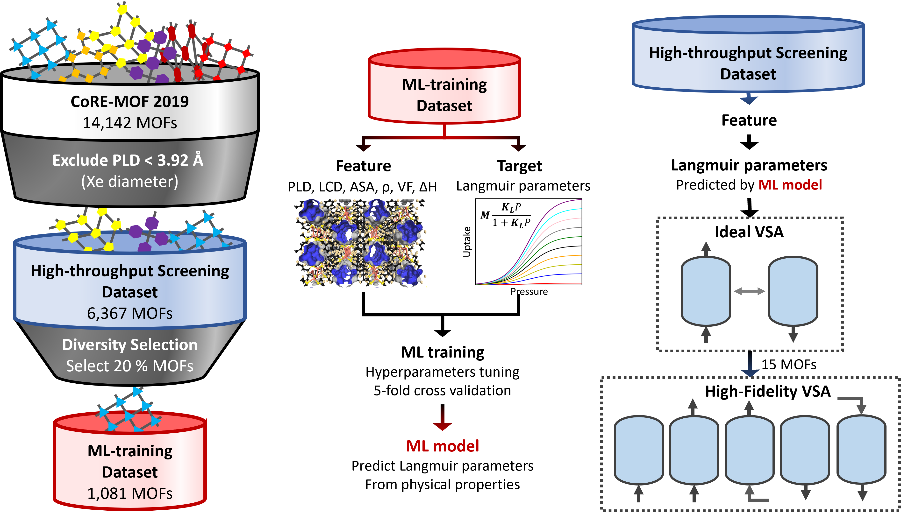

# Multi-scale computational screening of MOFs for Xe/Kr separation
                     

### Contact
Prof. Chung: drygchung@gmail.com                                               
Guobin Zhao: sxmzhaogb@gmai.com            
Yu Chen:     yuchen.drake@gmail.com        

**Group:**   [Molecular Thermodynamics & Advance Processes Laboratory](https://sites.google.com/view/mtap-lab/home?authuser=0)                                

### Cite as
Guobin Zhao, Yu Chen and Yongchul G. Chung. **High-Throughput, Multiscale Computational Screening of Metal–Organic Frameworks for Xe/Kr Separation with Machine-Learned Parameters.** *Industrial & Engineering Chemistry Research* DOI: 10.1021/acs.iecr.3c02211. [read paper](https://pubs.acs.org/doi/full/10.1021/acs.iecr.3c02211)                                    

## Introduction

The Xe/Kr separation program contain 3 parts:
- Dataser preparation (GCMC simulation, Fitting)
- Machine learning (Train models, Evaluation models, Features analysis, Predict targets)
- Ideal VSA and High-fidelity VSA simualtion (High-througput ~6,500 MOFs & 15 MOFs)

## Data download                          

For all csv data, code and models, you can download from [zenodo](https://zenodo.org/record/8312801)            
ZHAO GUOBIN, & Chung Yongchul G. (2023). Multiscale high-throughput computational screening of nanoporous materials for Xe/Kr adsorption separation. https://doi.org/10.5281/zenodo.8312801             
